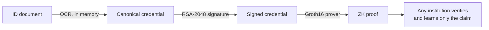

# zkID

**Zero-Knowledge Proof Framework for Cross-Institutional KYC Compliance**

Verify a customer once and let any institution check the result without seeing their personal data. zkID turns an identity document into zero-knowledge proofs of facts like *"over 18"*. The proofs are bound to an issuer's signature, and institutions can check them without ever seeing the underlying data.

   

---

## Highlights

- **Selective disclosure.** Prove age ≥ 18, a name match or a gender match. The verifier learns *yes*, never the date of birth, name or ID number.
- **Issuer-bound proofs.** One circuit verifies an RSA-2048 signature *and* reads the date of birth from the signed bytes, so a proof can only attest to what the issuer signed. Altering one byte breaks it.
- **Verifiable by anyone.** Every proof type has a Groth16 Solidity verifier for Polygon Amoy. Checking a proof is a free, read-only call that needs no wallet and no gas.
- **Privacy by design.** Images are processed in memory and never written to disk. Only hashes and encoded values are stored, and raw ID numbers are never logged or persisted.
- **Strict validation.** Garbled or impossible dates (like 31 Feb) and missing fields are rejected before signing. Machine-readable error codes separate *retake the photo* from *not eligible*.

## How it works



1. **Extract**: OCR reads name, date of birth, ID number and gender from the document.
2. **Sign**: the fields become a fixed 119-byte canonical payload, signed by the issuer.
3. **Prove**: a Groth16 circuit checks the signature, extracts the date of birth in-circuit and asserts the age threshold.
4. **Verify**: the relying institution checks the proof against a public verification key or an on-chain contract.

## Proofs

| Proof | Proves | Hidden | Verification |
|---|---|---|---|
| **Credential age** | Issuer signed the credential, and its holder is ≥ 18 | Name, DOB, ID, gender | Off-chain + on-chain · ~4 s to prove |
| **Age** | DOB ≤ threshold date | Date of birth | Off-chain + on-chain |
| **Name** | Name matches a claimed identity | Name | Off-chain + on-chain |
| **Gender** | Gender matches a claimed value | Gender | Off-chain + on-chain |

The credential circuit combines SHA-256, RSA-2048 (`RSAVerifier65537(121, 17)`), a uniqueness scan for the `"dob":"` field, digit range checks and a date comparison. That comes to **256,574 constraints** in total.

## Quick start

```bash
cp .env.example .env                          # SUPABASE_URL, SUPABASE_SERVICE_ROLE_KEY
cd backend  && npm install && npm run dev     # API on :3001
cd frontend && npm install && npm run dev     # UI on :5173
```

Open `http://localhost:5173`, upload an Aadhaar image or pick a demo scenario, then generate an issuer-signed proof in the **Prove** step.

Issuer-signed proof from the command line (after building the credential circuit, below):

```bash
curl -s -X POST localhost:3001/api/signed-proof \
  -H 'Content-Type: application/json' -d '{"scenario":"valid"}'
```

<details>
<summary><b>Supabase table</b></summary>

```sql
create table public.users (
  id           uuid primary key default gen_random_uuid(),
  name         text,
  dob_encoded  integer,
  aadhaar_hash text,
  name_hash    text,
  gender_code  integer,
  created_at   timestamptz default now()
);
alter table public.users enable row level security;
```

The backend uses the service role key, which stays on the server. The browser only talks to the backend.
</details>

<details>
<summary><b>Build the credential circuit</b></summary>

The proving key is 128 MB, so it is built locally rather than committed. This needs `circom` 2.x and `snarkjs`.

```bash
cd experiments/credential-age-proof
npm install
circom circuits/credential_age_proof.circom --r1cs --wasm --sym -l node_modules -o .
curl -sL -o powersOfTau28_hez_final_19.ptau \
  https://storage.googleapis.com/zkevm/ptau/powersOfTau28_hez_final_19.ptau
snarkjs groth16 setup credential_age_proof.r1cs powersOfTau28_hez_final_19.ptau cap_0000.zkey
snarkjs zkey contribute cap_0000.zkey cap_final.zkey -n="zkID" -e="$(openssl rand -hex 32)"
snarkjs zkey export verificationkey cap_final.zkey verification_key.json
rm cap_0000.zkey
```

A new proving key needs its own on-chain verifier: export it with `snarkjs zkey export solidityverifier cap_final.zkey ../../backend/hardhat-deploy/contracts/CredentialAgeVerifier.sol`, rename the contract to `CredentialAgeVerifier`, then run `npm run deploy:credential`.
</details>

<details>
<summary><b>Issuer and tamper tests</b></summary>

```bash
cd mock-issuer
node sign_credential.js      # sign payload.json with the demo issuer key
node verify_credential.js    # 12 independent checks, including tamper controls

cd ../experiments/credential-age-proof
W="node credential_age_proof_js/generate_witness.js credential_age_proof_js/credential_age_proof.wasm"
node gen_input.js && $W input.json w.wtns                                  # accepted
node gen_input.js --tamper=date && $W input_tampered_date.json w.wtns      # rejected: signature
node gen_input.js --threshold 19000101 --out f.json && $W f.json w.wtns    # rejected: age
```

Signed payload: four ASCII fields, sorted keys, no whitespace, space-padded to 119 bytes (two SHA-256 blocks), RSASSA-PKCS1-v1_5 / SHA-256.
</details>

## API

| Endpoint | Description |
|---|---|
| `POST /api/signed-proof` | Image or `{scenario}` → issuer-signed credential age proof |
| `POST /api/upload` | Image → OCR → privacy-preserving storage |
| `POST /api/demo` | Canned upload: `valid`, `underage`, `ocr_fail` |
| `POST /api/generate-proof` | `{userId}` → age proof |
| `POST /api/generate-name-proof` | `{userId, claimedName}` → name proof |
| `POST /api/generate-gender-proof` | `{userId, claimedGender}` → gender proof |

Error codes: `CREDENTIAL_UNPROCESSABLE` (retryable), `AGE_REQUIREMENT_NOT_MET`, `PROVING_UNAVAILABLE`.

## On-chain verifiers · Polygon Amoy

| Contract | Address |
|---|---|
| AgeVerifier | [`0xa5075F2E83167C3c7fE5c3C3F1Fc5FCF1d378232`](https://amoy.polygonscan.com/address/0xa5075F2E83167C3c7fE5c3C3F1Fc5FCF1d378232) |
| NameVerifier | [`0x23715a3216ACdF715a75463939A342b844dd01eE`](https://amoy.polygonscan.com/address/0x23715a3216ACdF715a75463939A342b844dd01eE) |

Addresses live in `frontend/src/contracts/addresses.json`. The UI verifies on-chain for every proof type listed there.

Deploy or replace a verifier (set `PRIVATE_KEY` in `backend/hardhat-deploy/.env.hardhat`). This writes the new address to `addresses.json` for you:

```bash
cd backend/hardhat-deploy
npm run deploy:gender        # also: deploy:credential, deploy:age, deploy:name
```

## Project structure

```
backend/          Express API: OCR, preprocessing, signing, proof generation
  circuits/       Age, Name and Gender circuits + keys
  hardhat-deploy/ Solidity verifiers and deploy scripts
frontend/         React UI: upload → preprocess → store → prove (signed, age, name, gender) → verify on-chain
mock-issuer/      RSA-2048 issuer: keygen, signing, independent verifier
experiments/
  credential-age-proof/  Issuer-bound credential circuit
```

**Stack:** circom 2 · snarkjs (Groth16, BN128) · Node.js / Express · Tesseract.js · Supabase · React / Vite · ethers.js · Hardhat · Polygon Amoy
