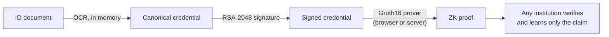

# zkID

**Zero-Knowledge Proof Framework for Cross-Institutional KYC Compliance**

Verify a customer once and let any institution check the result without seeing their personal data. zkID turns an identity document into zero-knowledge proofs of facts like *"over 18"*. The proofs are bound to an issuer's signature, and institutions can check them without ever seeing the underlying data.

   

---

## Highlights

- **Selective disclosure.** Prove age ≥ 18, a name match or a gender match. The verifier learns *yes*, never the date of birth, name or ID number.
- **Issuer-bound proofs.** Each circuit verifies an RSA-2048 signature *and* reads the date of birth, name or gender from the signed bytes, so a proof can only attest to what the issuer signed. Altering one byte breaks it.
- **Prove on your own device.** The issuer only signs the credential. The holder's browser generates the proof in about 5 seconds, so no server ever sees the private inputs.
- **Checked against a policy.** A valid proof alone doesn't say *who* signed. `ZkIdPolicy` on Ethereum Sepolia accepts a proof only from a trusted issuer and, for age, with today's 18-year cutoff. Checking is a free, read-only call that needs no wallet and no gas, and the app applies the same checks off-chain.
- **Privacy by design.** Images are processed in memory and never written to disk. Only hashes and encoded values are stored, and raw ID numbers are never logged or persisted.
- **Strict validation.** Garbled or impossible dates (like 31 Feb) and missing fields are rejected before signing. Machine-readable error codes separate *retake the photo* from *not eligible*.
- **Real Aadhaar card variants.** Reads bilingual cards (English and Hindi by default), masked Aadhaar and cards that print only a year of birth. A VID or an issue date is never mistaken for the Aadhaar number or the date of birth.
- **Proof QR codes.** A signed proof can be shown as a QR code. Any phone camera opens the verifier page, which checks the proof in the browser against a trusted-issuer list and today's 18-year cutoff.

## How it works



1. **Extract**: OCR reads name, date of birth, ID number and gender from the document.
2. **Sign**: the fields become a fixed 119-byte canonical payload, signed by the issuer.
3. **Prove**: in the holder's browser or on the server, a Groth16 circuit checks the signature, reads the date of birth, name or gender in-circuit and checks the claim.
4. **Verify**: the relying institution checks the proof *and* its policy (trusted issuer, and for age today's cutoff), on-chain with `ZkIdPolicy` or in the browser.

## Proofs

| Proof | Proves | Hidden | Circuit |
|---|---|---|---|
| **Age 18+** | The issuer signed the credential, and its holder is 18 or older today | Name, DOB, ID, gender | `CredentialAgeProof`, 256,574 constraints |
| **Name** | The issuer signed the credential, and its name matches a claimed name (case and spacing ignored) | DOB, ID, gender | `CredentialMatchProof`, 260,903 constraints |
| **Gender** | The issuer signed the credential, and its gender matches a claimed gender | Name, DOB, ID | `CredentialMatchProof` |

Every proof takes about 5 s in the browser or 4 s on the server and is checked by `ZkIdPolicy`. Both circuits combine SHA-256, RSA-2048 (`RSAVerifier65537(121, 17)`) and a uniqueness scan for the field they read. The age circuit then checks the date's digits and compares it with the cutoff. The match circuit reads the name (up to 49 characters) and gender from the same signed bytes, lowercases the name and compares its Poseidon hash with the public claim. A claim of 0 is not checked, so one proof can cover the name, the gender or both.

Earlier versions had separate age, name and gender circuits that took their private input without any signature, so anyone could prove any claim. They were removed; their Sepolia verifiers stay deployed but are listed as retired.

## Relying-party policy

[`ZkIdPolicy`](backend/hardhat-deploy/contracts/ZkIdPolicy.sol) wraps both verifiers:

- `checkAge(proof, signals)` and `checkMatch(proof, signals)` return `Accepted`, `UntrustedIssuer`, `CutoffTooLate`, `NothingClaimed` or `InvalidProof`.
- The issuer's key (the first 17 public signals) must be on an owner-managed list, keyed by the keccak256 of its limbs (`setIssuer`).
- For age, the cutoff must be no later than 18 years before the block's UTC date, computed with the same integer arithmetic as the backend.
- For name and gender, at least one claim must be set, and the caller compares the claims it needs with public signals 17 (name hash) and 18 (gender: 1 M, 2 F, 3 O).

The app and the verifier page apply the same checks off-chain ([`frontend/src/verify/policy.js`](frontend/src/verify/policy.js)), against the issuers in [`trustedIssuers.js`](frontend/src/verify/trustedIssuers.js).

## Aadhaar card variants

| Card | Read as | Signed credential | Stored record |
|---|---|---|---|
| Year of birth only | `1985` | `"dob":"1985-99-99"` | `dob_encoded = 19859999` |
| Masked Aadhaar | `XXXX XXXX 4321` | `"id_number":"XXXXXXXX4321"` | no `aadhaar_hash` stored |
| Bilingual | English text, Hindi labels as a fallback | unchanged | unchanged |

`YYYY-99-99` sorts after every real date in that year, so the age check assumes the latest possible birthday and can never overstate age: someone with only a year of birth passes from 1 January of the year after they could have turned 18. Both forms go through the published circuits and the deployed verifiers unchanged.

OCR reads English and Hindi by default. Hindi lines otherwise come out as Latin noise that can pass for a name. Set `OCR_LANGS` (for example `eng+hin+tam`) to read other scripts; each language adds OCR time, and `eng+hin` takes about twice as long as `eng` alone.

## Proof QR codes

After an age proof, **Show as QR code** packs it into 270 bytes: format version, proof type, an 8-byte issuer key ID, the cutoff date and the Groth16 proof. The QR code opens `/#/verify?p=…`, and a URL fragment never reaches a server. The verifier page (also under **Verify a proof**) scans with the camera or reads an uploaded image, and accepts only if:

1. the issuer key ID is in [`frontend/src/verify/trustedIssuers.js`](frontend/src/verify/trustedIssuers.js), the relying party's list,
2. the proof verifies under that issuer's key, and
3. the cutoff date is no later than today's 18-year cutoff. An earlier cutoff is only stricter.

A copy or screenshot of the code verifies the same way: it isn't bound to a session or to the person showing it.

## Quick start

```bash
cp .env.example .env                                                 # SUPABASE_URL, SUPABASE_SERVICE_ROLE_KEY
cd backend  && npm install && npm run fetch-circuit && npm run dev   # API on :3001
cd frontend && npm install && npm run dev                            # UI on :5173
```

Open `http://localhost:5173`, upload an Aadhaar image or pick a demo scenario, then generate an issuer-signed proof in the **Prove** step.

`npm run fetch-circuit` downloads both circuits' proving keys, wasm and verification keys (~270 MB) from the [`circuit-v1`](https://github.com/bhargava-sarma/zkID/releases/tag/circuit-v1) and [`circuit-match-v1`](https://github.com/bhargava-sarma/zkID/releases/tag/circuit-match-v1) releases and checks each file's SHA-256. These are the exact files the deployed verifiers were built from.

Issuer-signed proofs from the command line:

```bash
curl -s -X POST localhost:3001/api/signed-proof \
  -H 'Content-Type: application/json' -d '{"scenario":"valid"}'
curl -s -X POST localhost:3001/api/signed-match-proof \
  -H 'Content-Type: application/json' -d '{"scenario":"valid","claimedName":"Rajesh Kumar"}'
```

<details>
<summary><b>Supabase table</b></summary>

```sql
create table public.users (
  id           uuid primary key default gen_random_uuid(),
  name         text,
  dob_encoded  integer,
  aadhaar_hash text,
  name_hash    text,
  gender_code  integer,
  created_at   timestamptz default now()
);
alter table public.users enable row level security;
```

The backend uses the service role key, which stays on the server. The browser only talks to the backend.
</details>

<details>
<summary><b>Verify or rebuild the credential circuit</b></summary>

Needs `circom` 2.x and `snarkjs`. The Hermez Powers of Tau file is mirrored in the release; its BLAKE2b hash matches the one published by snarkjs.

```bash
cd backend/circuits/credential-age-proof
npm install
circom circuits/credential_age_proof.circom --r1cs --wasm --sym -l node_modules -o .
curl -fL -o powersOfTau28_hez_final_19.ptau \
  https://github.com/bhargava-sarma/zkID/releases/download/circuit-v1/powersOfTau28_hez_final_19.ptau
echo "bca9d8b04242f175189872c42ceaa21e2951e0f0f272a0cc54fc37193ff6648600eaf1c555c70cdedfaf9fb74927de7aa1d33dc1e2a7f1a50619484989da0887  powersOfTau28_hez_final_19.ptau" | b2sum -c

# Verify the published key was derived from this circuit and ceremony
snarkjs zkey verify credential_age_proof.r1cs powersOfTau28_hez_final_19.ptau cap_final.zkey

# Or build a new key from scratch
snarkjs groth16 setup credential_age_proof.r1cs powersOfTau28_hez_final_19.ptau cap_0000.zkey
snarkjs zkey contribute cap_0000.zkey cap_final.zkey -n="zkID" -e="$(openssl rand -hex 32)"
snarkjs zkey export verificationkey cap_final.zkey verification_key.json
rm cap_0000.zkey
```

A new proving key needs its own on-chain verifier: export it with `snarkjs zkey export solidityverifier cap_final.zkey ../../hardhat-deploy/contracts/CredentialAgeVerifier.sol`, rename the contract to `CredentialAgeVerifier`, then run `npm run deploy:credential` and `npm run deploy:policy`.

The match circuit works the same way in `backend/circuits/credential-match-proof`, with `credential_match_proof`, `cmp_final.zkey`, `match_verification_key.json`, `CredentialMatchVerifier` and `npm run deploy:match`. Its key was set up on the same pot19 file with its own random contribution.
</details>

<details>
<summary><b>Issuer and tamper tests</b></summary>

```bash
cd mock-issuer
node sign_credential.js      # sign payload.json with the demo issuer key
node verify_credential.js    # 12 independent checks, including tamper controls

cd ../backend/circuits/credential-age-proof
W="node credential_age_proof_js/generate_witness.js credential_age_proof_js/credential_age_proof.wasm"
node gen_input.js && $W input.json w.wtns                                  # accepted
node gen_input.js --tamper=date && $W input_tampered_date.json w.wtns      # rejected: signature
node gen_input.js --threshold 19000101 --out f.json && $W f.json w.wtns    # rejected: age

cd ../credential-match-proof
W="node credential_match_proof_js/generate_witness.js credential_match_proof_js/credential_match_proof.wasm"
node gen_input.js --name "test user one" --gender M && $W input.json w.wtns          # accepted
node gen_input.js --name "Test User Two" --out f.json && $W f.json w.wtns           # rejected: name
node gen_input.js --tamper=name --name "Test User One" && $W input_tampered_name.json w.wtns  # rejected: signature
```

Signed payload: four ASCII fields, sorted keys, no whitespace, space-padded to 119 bytes (two SHA-256 blocks), RSASSA-PKCS1-v1_5 / SHA-256. `dob` is `YYYY-MM-DD`, or `YYYY-99-99` for a year of birth; `id_number` is 12 digits, or `XXXXXXXX` and the last 4 digits for a masked Aadhaar.
</details>

<details>
<summary><b>Tests</b></summary>

```bash
cd backend                && npm test   # OCR, card variants, signing, both circuits (after npm run fetch-circuit)
cd backend/hardhat-deploy && npm test   # ZkIdPolicy on a local chain with the real verifiers
cd frontend               && npm test   # QR codes, verifier policy, browser match input
```
</details>

## API

| Endpoint | Description |
|---|---|
| `POST /api/signed-proof` | Image or `{scenario}` → issuer-signed age proof, proved on the server |
| `POST /api/signed-match-proof` | Image or `{scenario}`, plus `claimedName` and/or `claimedGender` (`M`, `F`, `O`) → issuer-signed name/gender proof, proved on the server |
| `POST /api/issue-credential` | Image or `{scenario}` → signed credential as circuit input, for proving in the browser |
| `POST /api/upload` | Image → OCR → stored KYC record (hashes and encoded values) |
| `POST /api/demo` | Canned upload: `valid`, `underage`, `year_only`, `masked_id`, `ocr_fail` |

Error codes: `CREDENTIAL_UNPROCESSABLE` (retryable), `AGE_REQUIREMENT_NOT_MET`, `CLAIM_MISMATCH`, `PROVING_UNAVAILABLE`. The signed endpoints also return `card: { yearOfBirthOnly, maskedId }`.

## Deploy to Vercel

One Vercel project runs two services, defined in [`vercel.json`](vercel.json): the frontend (UI and circuit files) and the backend (the Express API at `/api`).

1. In Vercel, **Add New → Project** and import this repo. Leave the root directory as is.
2. Add the environment variables `SUPABASE_URL` and `SUPABASE_SERVICE_ROLE_KEY`.
3. Click **Deploy**.

On Vercel, proofs run in the visitor's browser, because server-side proving needs about 3 GB of RAM. The build downloads both proving keys from the releases and serves them as static files in 20 MB parts. Uploads are limited to 4 MB.

## On-chain contracts · Ethereum Sepolia

| Contract | Role | Address |
|---|---|---|
| `ZkIdPolicy` | Relying-party policy over both verifiers; what the app calls | [`0x8eDa6b1A54900c60C6b730796FfDd51a5327714f`](https://sepolia.etherscan.io/address/0x8eDa6b1A54900c60C6b730796FfDd51a5327714f) |
| `CredentialAgeVerifier` | Age proof (18 public signals) | [`0x1052Fc75ce491137D4FA7691b427D5356505b1cd`](https://sepolia.etherscan.io/address/0x1052Fc75ce491137D4FA7691b427D5356505b1cd) |
| `CredentialMatchVerifier` | Name and gender proof (19 public signals) | [`0x7bD0f448459f1Eb3F80113df712F2f71DD0B7641`](https://sepolia.etherscan.io/address/0x7bD0f448459f1Eb3F80113df712F2f71DD0B7641) |

The UI reads addresses from [`frontend/src/contracts/addresses.json`](frontend/src/contracts/addresses.json), where the removed circuits' verifiers are listed under `retired`. Source code is verified on Etherscan (see the links above) and on Sourcify (exact match). After a redeploy, `npm run verify` publishes to both; Etherscan needs `ETHERSCAN_API_KEY` in `.env.hardhat`.

Deploy with Sepolia ETH (free from the [Google Cloud faucet](https://cloud.google.com/application/web3/faucet/ethereum/sepolia)) and `PRIVATE_KEY` set in `backend/hardhat-deploy/.env.hardhat`. Each deploy writes its address to `addresses.json`:

```bash
cd backend/hardhat-deploy
npm run deploy:all           # or one: deploy:credential, deploy:match, deploy:policy (after both verifiers)
```

## Project structure

```
backend/                          Express API: OCR, preprocessing, signing, proof generation
  circuits/
    credential-age-proof/         Age circuit + artifact fetcher
    credential-match-proof/       Name and gender circuit + artifact fetcher
  hardhat-deploy/                 Verifiers, ZkIdPolicy, deploy scripts and tests
frontend/                         React UI: upload → preprocess → store → prove → policy check
  src/prover/                     In-browser prover (Web Worker) and match input builder
  src/verify/                     Policy checks, trusted issuers, proof QR codes
  scripts/prepare-circuit.mjs     Stages circuit files in public/circuit/ before dev and build
mock-issuer/                      RSA-2048 issuer: keygen, signing, independent verifier
```

**Stack:** circom 2 · snarkjs (Groth16, BN128) · Node.js / Express · Tesseract.js · Supabase · React / Vite · ethers.js · node-qrcode · jsQR · poseidon-lite · Hardhat · Ethereum Sepolia
