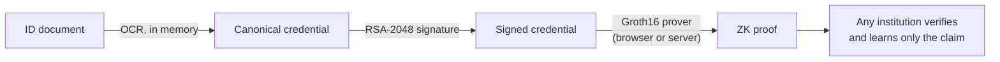

# zkID

**Zero-Knowledge Proof Framework for Cross-Institutional KYC Compliance**

Verify a customer once and let any institution check the result without seeing their personal data. zkID turns an identity document into zero-knowledge proofs of facts like *"over 18"*. The proofs are bound to an issuer's signature, and institutions can check them without ever seeing the underlying data.

   

---

## Highlights

- **Selective disclosure.** Prove age ≥ 18, a name match or a gender match. The verifier learns *yes*, never the date of birth, name or ID number.
- **Issuer-bound proofs.** One circuit verifies an RSA-2048 signature *and* reads the date of birth from the signed bytes, so a proof can only attest to what the issuer signed. Altering one byte breaks it.
- **Prove on your own device.** The issuer only signs the credential. The holder's browser generates the proof in about 5 seconds, so no server ever sees the private inputs.
- **Verifiable by anyone.** Every proof type has a Groth16 verifier on Ethereum Sepolia, with source verified on Etherscan and Sourcify. Checking a proof is a free, read-only call that needs no wallet and no gas.
- **Privacy by design.** Images are processed in memory and never written to disk. Only hashes and encoded values are stored, and raw ID numbers are never logged or persisted.
- **Strict validation.** Garbled or impossible dates (like 31 Feb) and missing fields are rejected before signing. Machine-readable error codes separate *retake the photo* from *not eligible*.
- **Real Aadhaar card variants.** Reads bilingual cards (English and Hindi by default), masked Aadhaar and cards that print only a year of birth. A VID or an issue date is never mistaken for the Aadhaar number or the date of birth.
- **Proof QR codes.** A signed proof can be shown as a QR code. Any phone camera opens the verifier page, which checks the proof in the browser against a trusted-issuer list and today's 18-year cutoff.

## How it works



1. **Extract**: OCR reads name, date of birth, ID number and gender from the document.
2. **Sign**: the fields become a fixed 119-byte canonical payload, signed by the issuer.
3. **Prove**: in the holder's browser or on the server, a Groth16 circuit checks the signature, extracts the date of birth in-circuit and asserts the age threshold.
4. **Verify**: the relying institution checks the proof against a public verification key or an on-chain contract.

## Proofs

| Proof | Proves | Hidden | Verification |
|---|---|---|---|
| **Credential age** | Issuer signed the credential, and its holder is ≥ 18 | Name, DOB, ID, gender | Off-chain + on-chain · ~5 s to prove, in the browser or on the server |
| **Age** | DOB ≤ threshold date | Date of birth | Off-chain + on-chain |
| **Name** | Name matches a claimed identity | Name | Off-chain + on-chain |
| **Gender** | Gender matches a claimed value | Gender | Off-chain + on-chain |

The credential circuit combines SHA-256, RSA-2048 (`RSAVerifier65537(121, 17)`), a uniqueness scan for the `"dob":"` field, digit range checks and a date comparison. That comes to **256,574 constraints** in total.

## Aadhaar card variants

| Card | Read as | Signed credential | Legacy path |
|---|---|---|---|
| Year of birth only | `1985` | `"dob":"1985-99-99"` | `dob_encoded = 19859999` |
| Masked Aadhaar | `XXXX XXXX 4321` | `"id_number":"XXXXXXXX4321"` | no `aadhaar_hash` stored |
| Bilingual | English text, Hindi labels as a fallback | unchanged | unchanged |

`YYYY-99-99` sorts after every real date in that year, so the age check assumes the latest possible birthday and can never overstate age: someone with only a year of birth passes from 1 January of the year after they could have turned 18. Both forms go through the published circuit and the deployed `CredentialAgeVerifier` unchanged.

OCR reads English and Hindi by default. Hindi lines otherwise come out as Latin noise that can pass for a name. Set `OCR_LANGS` (for example `eng+hin+tam`) to read other scripts; each language adds OCR time, and `eng+hin` takes about twice as long as `eng` alone.

## Proof QR codes

After a signed-credential proof, **Show as QR code** packs it into 270 bytes: format version, proof type, an 8-byte issuer key ID, the cutoff date and the Groth16 proof. The QR code opens `/#/verify?p=…`, and a URL fragment never reaches a server. The verifier page (also under **Verify a proof**) scans with the camera or reads an uploaded image, and accepts only if:

1. the issuer key ID is in [`frontend/src/verify/trustedIssuers.js`](frontend/src/verify/trustedIssuers.js), the relying party's list,
2. the proof verifies under that issuer's key, and
3. the cutoff date is no later than today's 18-year cutoff. An earlier cutoff is only stricter.

A copy or screenshot of the code verifies the same way: it isn't bound to a session or to the person showing it. Only signed-credential proofs get a QR code, because the legacy age, name and gender proofs aren't tied to a signed credential, so a third party can't rely on them.

## Quick start

```bash
cp .env.example .env                                                 # SUPABASE_URL, SUPABASE_SERVICE_ROLE_KEY
cd backend  && npm install && npm run fetch-circuit && npm run dev   # API on :3001
cd frontend && npm install && npm run dev                            # UI on :5173
```

Open `http://localhost:5173`, upload an Aadhaar image or pick a demo scenario, then generate an issuer-signed proof in the **Prove** step.

`npm run fetch-circuit` downloads the credential circuit's proving key, wasm and verification key (~135 MB) from the [`circuit-v1` release](https://github.com/bhargava-sarma/zkID/releases/tag/circuit-v1) and checks each file's SHA-256. These are the exact files the deployed `CredentialAgeVerifier` was built from.

Issuer-signed proof from the command line:

```bash
curl -s -X POST localhost:3001/api/signed-proof \
  -H 'Content-Type: application/json' -d '{"scenario":"valid"}'
```

<details>
<summary><b>Supabase table</b></summary>

```sql
create table public.users (
  id           uuid primary key default gen_random_uuid(),
  name         text,
  dob_encoded  integer,
  aadhaar_hash text,
  name_hash    text,
  gender_code  integer,
  created_at   timestamptz default now()
);
alter table public.users enable row level security;
```

The backend uses the service role key, which stays on the server. The browser only talks to the backend.
</details>

<details>
<summary><b>Verify or rebuild the credential circuit</b></summary>

Needs `circom` 2.x and `snarkjs`. The Hermez Powers of Tau file is mirrored in the release; its BLAKE2b hash matches the one published by snarkjs.

```bash
cd backend/circuits/credential-age-proof
npm install
circom circuits/credential_age_proof.circom --r1cs --wasm --sym -l node_modules -o .
curl -fL -o powersOfTau28_hez_final_19.ptau \
  https://github.com/bhargava-sarma/zkID/releases/download/circuit-v1/powersOfTau28_hez_final_19.ptau
echo "bca9d8b04242f175189872c42ceaa21e2951e0f0f272a0cc54fc37193ff6648600eaf1c555c70cdedfaf9fb74927de7aa1d33dc1e2a7f1a50619484989da0887  powersOfTau28_hez_final_19.ptau" | b2sum -c

# Verify the published key was derived from this circuit and ceremony
snarkjs zkey verify credential_age_proof.r1cs powersOfTau28_hez_final_19.ptau cap_final.zkey

# Or build a new key from scratch
snarkjs groth16 setup credential_age_proof.r1cs powersOfTau28_hez_final_19.ptau cap_0000.zkey
snarkjs zkey contribute cap_0000.zkey cap_final.zkey -n="zkID" -e="$(openssl rand -hex 32)"
snarkjs zkey export verificationkey cap_final.zkey verification_key.json
rm cap_0000.zkey
```

A new proving key needs its own on-chain verifier: export it with `snarkjs zkey export solidityverifier cap_final.zkey ../../hardhat-deploy/contracts/CredentialAgeVerifier.sol`, rename the contract to `CredentialAgeVerifier`, then run `npm run deploy:credential`.
</details>

<details>
<summary><b>Issuer and tamper tests</b></summary>

```bash
cd mock-issuer
node sign_credential.js      # sign payload.json with the demo issuer key
node verify_credential.js    # 12 independent checks, including tamper controls

cd ../backend/circuits/credential-age-proof
W="node credential_age_proof_js/generate_witness.js credential_age_proof_js/credential_age_proof.wasm"
node gen_input.js && $W input.json w.wtns                                  # accepted
node gen_input.js --tamper=date && $W input_tampered_date.json w.wtns      # rejected: signature
node gen_input.js --threshold 19000101 --out f.json && $W f.json w.wtns    # rejected: age
```

Signed payload: four ASCII fields, sorted keys, no whitespace, space-padded to 119 bytes (two SHA-256 blocks), RSASSA-PKCS1-v1_5 / SHA-256. `dob` is `YYYY-MM-DD`, or `YYYY-99-99` for a year of birth; `id_number` is 12 digits, or `XXXXXXXX` and the last 4 digits for a masked Aadhaar.
</details>

<details>
<summary><b>Tests</b></summary>

```bash
cd backend  && npm test   # OCR parsing, card variants, signing; circuit checks need npm run fetch-circuit
cd frontend && npm test   # proof QR code format and verifier policy
```
</details>

## API

| Endpoint | Description |
|---|---|
| `POST /api/signed-proof` | Image or `{scenario}` → issuer-signed credential age proof, proved on the server |
| `POST /api/issue-credential` | Image or `{scenario}` → signed credential as circuit input, for proving in the browser |
| `POST /api/upload` | Image → OCR → privacy-preserving storage |
| `POST /api/demo` | Canned upload: `valid`, `underage`, `year_only`, `masked_id`, `ocr_fail` |
| `POST /api/generate-proof` | `{userId}` → age proof |
| `POST /api/generate-name-proof` | `{userId, claimedName}` → name proof |
| `POST /api/generate-gender-proof` | `{userId, claimedGender}` → gender proof |

Error codes: `CREDENTIAL_UNPROCESSABLE` (retryable), `AGE_REQUIREMENT_NOT_MET`, `PROVING_UNAVAILABLE`. Both signed endpoints also return `card: { yearOfBirthOnly, maskedId }`.

## Deploy to Vercel

One Vercel project runs two services, defined in [`vercel.json`](vercel.json): the frontend (UI and circuit files) and the backend (the Express API at `/api`).

1. In Vercel, **Add New → Project** and import this repo. Leave the root directory as is.
2. Add the environment variables `SUPABASE_URL` and `SUPABASE_SERVICE_ROLE_KEY`.
3. Click **Deploy**.

On Vercel, issuer-signed proofs run in the visitor's browser, because server-side proving needs about 3 GB of RAM. Uploads are limited to 4 MB.

## On-chain verifiers · Ethereum Sepolia

| Contract | Verifies | Address |
|---|---|---|
| `CredentialAgeVerifier` | Issuer-signed credential age proof (18 public signals) | [`0x1052Fc75ce491137D4FA7691b427D5356505b1cd`](https://sepolia.etherscan.io/address/0x1052Fc75ce491137D4FA7691b427D5356505b1cd) |
| `AgeVerifier` | Age proof | [`0x23715a3216ACdF715a75463939A342b844dd01eE`](https://sepolia.etherscan.io/address/0x23715a3216ACdF715a75463939A342b844dd01eE) |
| `NameVerifier` | Name proof | [`0xa5075F2E83167C3c7fE5c3C3F1Fc5FCF1d378232`](https://sepolia.etherscan.io/address/0xa5075F2E83167C3c7fE5c3C3F1Fc5FCF1d378232) |
| `GenderVerifier` | Gender proof | [`0x69D8A7Ac149Ed63364DF5DFFDEC25c25cE2417B9`](https://sepolia.etherscan.io/address/0x69D8A7Ac149Ed63364DF5DFFDEC25c25cE2417B9) |

The UI reads addresses from [`frontend/src/contracts/addresses.json`](frontend/src/contracts/addresses.json) and checks on-chain for every proof type listed there. Source code is verified on Etherscan (see the links above) and on [Sourcify](https://repo.sourcify.dev/11155111/0x1052Fc75ce491137D4FA7691b427D5356505b1cd) (exact match). After a redeploy, `npm run verify` publishes to both; Etherscan needs `ETHERSCAN_API_KEY` in `.env.hardhat`.

Deploy with Sepolia ETH (free from the [Google Cloud faucet](https://cloud.google.com/application/web3/faucet/ethereum/sepolia)) and `PRIVATE_KEY` set in `backend/hardhat-deploy/.env.hardhat`. Each deploy writes its address to `addresses.json`:

```bash
cd backend/hardhat-deploy
npm run deploy:all           # or one: deploy:credential, deploy:age, deploy:name, deploy:gender
```

## Project structure

```
api/                              Vercel Function entry (exports the Express app)
backend/                          Express API: OCR, preprocessing, signing, proof generation
  circuits/                       Age, Name and Gender circuits + keys
    credential-age-proof/         Issuer-bound credential circuit + artifact fetcher
  hardhat-deploy/                 Solidity verifiers and deploy scripts
frontend/                         React UI: upload → preprocess → store → prove → verify on-chain
  src/prover/                     In-browser credential prover (Web Worker)
  src/verify/                     Proof QR code format, trusted issuers, verifier checks
  scripts/prepare-circuit.mjs     Stages circuit files in public/circuit/ before dev and build
mock-issuer/                      RSA-2048 issuer: keygen, signing, independent verifier
```

**Stack:** circom 2 · snarkjs (Groth16, BN128) · Node.js / Express · Tesseract.js · Supabase · React / Vite · ethers.js · node-qrcode · jsQR · Hardhat · Ethereum Sepolia
